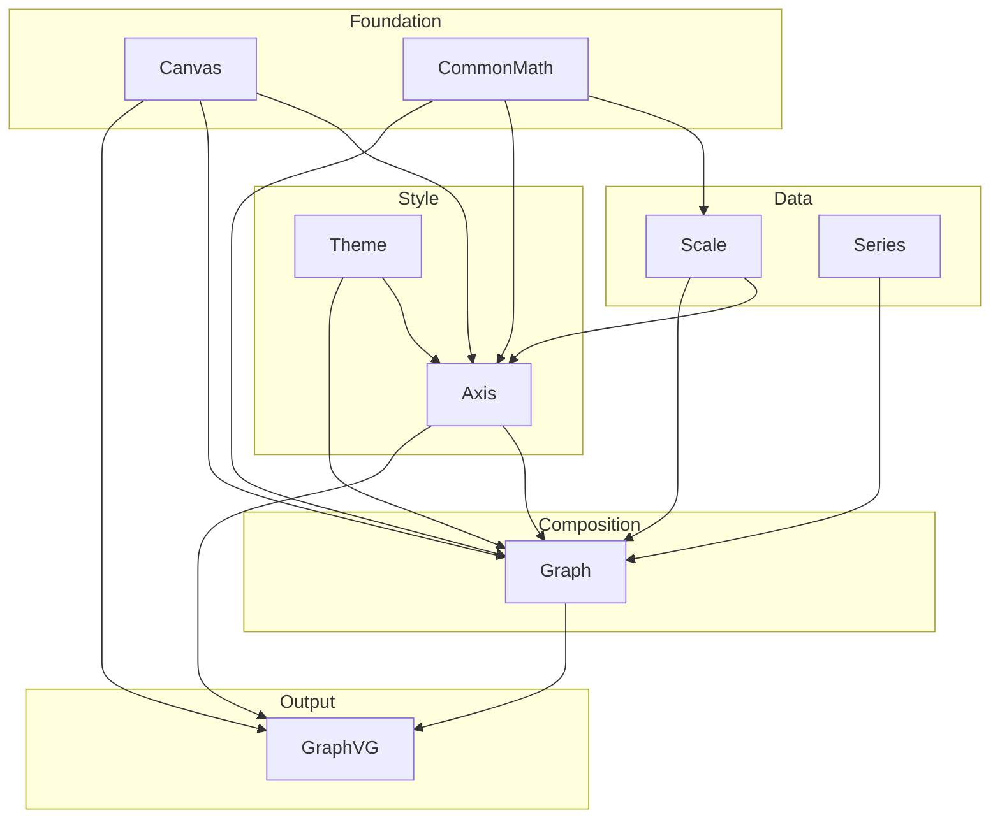
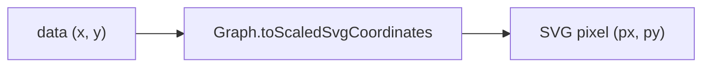
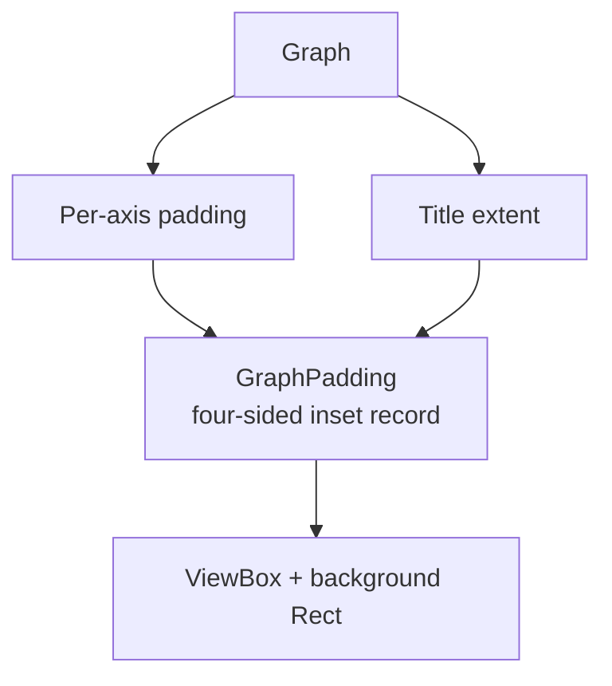
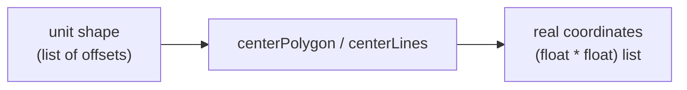

# GraphVG Design

Architecture reference for the GraphVG library. Focuses on the *why* behind structural decisions — for the *what*, read the source.

---

## Module architecture



Each layer only depends on layers below it. `CommonMath` and `Canvas` are the shared foundation with no upward dependencies.

---

## Coordinate system

Data coordinates are transformed to SVG coordinates in two stages:

```
data (x, y)  →  Scale.apply  →  SVG pixel (px, py)
```

The Y axis is **inverted**: SVG origin is top-left, so `Scale.apply yScale` maps the data minimum to `canvasSize` and the data maximum to `0`. This means increasing data values move upward visually, matching conventional chart orientation.

The canvas is a fixed `1000×1000` internal unit square. The SVG `viewBox` extends this outward by the computed padding margin to accommodate axes, labels, and titles.



---

## Layout padding model

`GraphVG.fs` computes how much space each side of the canvas needs before building the SVG. This is a two-stage process:



`GraphPadding` is a private four-sided record (`Top`, `Right`, `Bottom`, `Left`). It is intentionally separate from SharpVG's `Area` type, which only models width and height. Independent sides are needed because title, top-axis labels, bottom-axis labels, and left/right-axis labels each reserve different amounts of space.

SharpVG primitives (`Point`, `Area`, `ViewBox`, `Rect`) are only created at the final boundary where geometry is emitted — not during the padding calculation itself.

---

## CommonMath

`CommonMath.fs` is the single location for pure coordinate math — functions that operate only on plain `float` or `(float * float)` values with no dependency on SharpVG types.

### Unit-shape pattern

Shapes are expressed as **unit offsets**: vertices relative to a center at the origin with a radius of 1. A single generic transform (`scaleAndTranslate`) places any such shape at a real center and scale:



Adding a new scatter point shape requires only a new list constant — no new arithmetic. Do not inline offset arithmetic into rendering code.

### Future reorganization

As CommonMath grows it should be split into focused sub-modules (e.g. `Geometry`, `Numeric`). For now, all pure math lives here and must not depend on SharpVG or any other GraphVG module.

---

## Deferred: REQ-10 Adaptive canvas resolution

The canvas is currently fixed at `1000×1000`. When domain magnitudes are very large or very small, fixed annotation constants (tick length, font size, margin) become proportionally wrong.

The intended fix is to express annotation constants as fractions of canvas size and scale the canvas resolution to match data magnitude. This is blocked on first expressing all annotation sizes as canvas-relative fractions throughout `Axis.fs` and `GraphVG.fs`.
