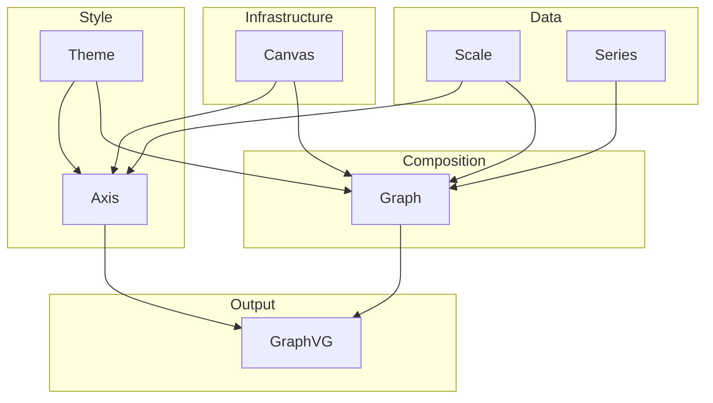

# GraphVG Design

Detailed design for all pending changes. Each section maps to one or more requirements and describes the before/after state, type changes, migration path, and open questions.

---

## Current architecture



---

## Overview of pending work

| Item | Requirement | Summary |
|------|-------------|---------|
| 3 | REQ-8 | API shape: `render : Graph -> string` |
| 4 | REQ-5 | Evolve `Graph` record to carry theme, axes, title |
| 5 | REQ-9 | Test coverage gaps (render smoke, grid lines) |
| — | REQ-10 | Adaptive canvas resolution (deferred) |

Items 3 and 4 are tightly coupled — REQ-8's clean `render : Graph -> string` is only possible once REQ-5's richer `Graph` record carries everything `render` needs. They should be implemented together.

---

## Item 3 + 4: Richer Graph record + simplified render API (REQ-5 + REQ-8)

### Current state

```fsharp
// Graph.fs
type Graph = {
    Series : Series list
    Domain : float * float
    Range  : float * float
}

// GraphVG.fs
val render : Graph -> Theme -> Axis list option -> Area option -> string
val drawSeries : Graph -> string          // convenience, uses Theme.empty
```

The caller is responsible for constructing axes with matching scales and passing theme separately. This works but creates drift risk (axes can reference scales that don't match `graph.Domain/Range`).

### Target state

```fsharp
// Graph.fs
type Graph = {
    Series : Series list
    XScale : Scale
    YScale : Scale
    XAxis  : Axis option        // None = no x-axis
    YAxis  : Axis option        // None = no y-axis
    Theme  : Theme
    Title  : string option
}

// GraphVG.fs
val toHtml : Graph -> string              // returns HTML page
val toSvg  : Graph -> string              // returns SVG string only
```

Everything render needs is in the `Graph`. Scales are authoritative — axes are built from them, not vice versa.

### Graph module API

```fsharp
module Graph =
    // Construction
    val create           : Series list -> (float * float) -> (float * float) -> Graph
    val createWithSeries : Series -> Graph           // auto-computes bounds + 10% pad

    // Data mutation
    val addSeries  : Series -> Graph -> Graph        // appends + recalculates bounds

    // Scale overrides
    val withXScale : Scale -> Graph -> Graph
    val withYScale : Scale -> Graph -> Graph

    // Axis control
    val withXAxis  : Axis option -> Graph -> Graph   // None suppresses x-axis
    val withYAxis  : Axis option -> Graph -> Graph   // None suppresses y-axis

    // Style / metadata
    val withTheme  : Theme        -> Graph -> Graph
    val withTitle  : string       -> Graph -> Graph

    // Bounds helpers (keep for tests + internal use)
    val addPadding : float -> Graph -> Graph
```

### Default axis behaviour

When `create` or `createWithSeries` builds a `Graph`, it auto-populates `XAxis` and `YAxis` with crosshair axes positioned at the data origin (same logic as current `Axis.defaults`). The user can override individually or as a pair:

```fsharp
// default: crosshair axes at origin
Graph.createWithSeries s

// suppress both axes at once
|> Graph.withAxes Axis.none

// set both axes at once (e.g. conventional bottom/left framing)
|> Graph.withAxes (
    Some (Axis.create Bottom xScale |> Axis.withLabel "X"),
    Some (Axis.create Left   yScale |> Axis.withLabel "Y"))

// override just one
|> Graph.withXAxis (Some (Axis.create Bottom xScale |> Axis.withLabel "time"))
|> Graph.withYAxis None   // suppress y-axis only
```

`Axis.none` is defined as `(None, None)` — a typed shorthand for the suppressed-both case.

`Graph.withAxes` takes `(Axis option * Axis option)` and sets both fields at once.

`Axis.defaults` is no longer called from `GraphVG.render` — instead it is called inside `Graph.create`/`createWithSeries` to set the initial axis values.

### Render API

```fsharp
module GraphVG =
    let render (graph : Graph) : string =
        // extracts graph.XScale, graph.YScale for coordinate transforms
        // renders graph.Theme.Background as SVG rect
        // renders series via graph.Theme + series kinds
        // renders grid lines if graph.Theme.GridPen is Some
        // renders graph.XAxis and graph.YAxis if Some
        // renders graph.Title if Some
        // returns full HTML page

    let toSvg (graph : Graph) : string =
        // same pipeline, returns raw SVG string instead of HTML page
```

The `size : Area option` parameter is dropped — callers who need a fixed pixel size can wrap the HTML or set CSS on the `<svg>` element. The SVG `viewBox` already handles scaling.

`drawSeries` is removed (replaced by `render`).

### Migration of Example.fs

```fsharp
// before
let html = GraphVG.render graph Theme.light None None

// after
let html =
    graph
    |> Graph.withTheme Theme.light
    |> GraphVG.render
```

### Coordinate transform

`Graph.toScaledSvgCoordinates` currently derives scales on every call. After this change it reads directly from `graph.XScale` / `graph.YScale`:

```fsharp
let toScaledSvgCoordinates graph (x, y) =
    Scale.apply graph.XScale x, Scale.apply graph.YScale y
```

Scales are set once at construction and stored, not recomputed per point.

### Breaking changes

| Old API | New API |
|---------|---------|
| `Graph.create series domain range` | unchanged |
| `Graph.createWithSeries s` | unchanged (now also sets default axes) |
| `GraphVG.render g theme axes size` | `GraphVG.render g` (theme/axes on `g`) |
| `GraphVG.drawSeries g` | `GraphVG.render g` |
| `Axis.defaults graph` | internal, called by `Graph.create` |
| `Axis.none` | `Graph.withXAxis None \|> Graph.withYAxis None` |

### Open questions

1. **`Domain`/`Range` vs `XScale`/`YScale`**: Current `addPadding`/`withPadding` logic works on `Domain`/`Range` tuples. After this change, padding logic mutates the scale domain instead. Is that clean enough, or should we keep `Domain`/`Range` as separate fields alongside the scales?
2. **`addSeries` recalculates bounds**: Currently recalculates from raw data. After migration, it needs to update `graph.XScale` and `graph.YScale` domains. Should axes auto-update to match, or stay as the user set them?
3. **`size` parameter removal**: Currently `Area option` lets callers fix the SVG to e.g. `800×600`. Dropping it means callers can only control size via CSS. Is that acceptable, or should `withSize` be a `Graph` builder instead?

---

## Item 5: Test coverage gaps (REQ-9)

Tests to add once items 3+4 are implemented:

| Test | What it verifies |
|------|-----------------|
| `render produces non-empty HTML` | smoke test for `GraphVG.render` |
| `render with Theme.light includes grid elements` | grid line rendering path |
| `render with no axes produces fewer elements` | `withXAxis None \|> withYAxis None` suppression |
| `render includes title text when set` | `withTitle` wired to output |
| `withTheme replaces theme on graph` | builder round-trip |

---

## Deferred: REQ-10 Adaptive canvas resolution

See REQUIREMENTS.md REQ-10. Not scheduled. Blocked on: annotation constants in `Axis.fs` (`tickLength`, `fontSize`) need to become canvas-relative fractions first.
