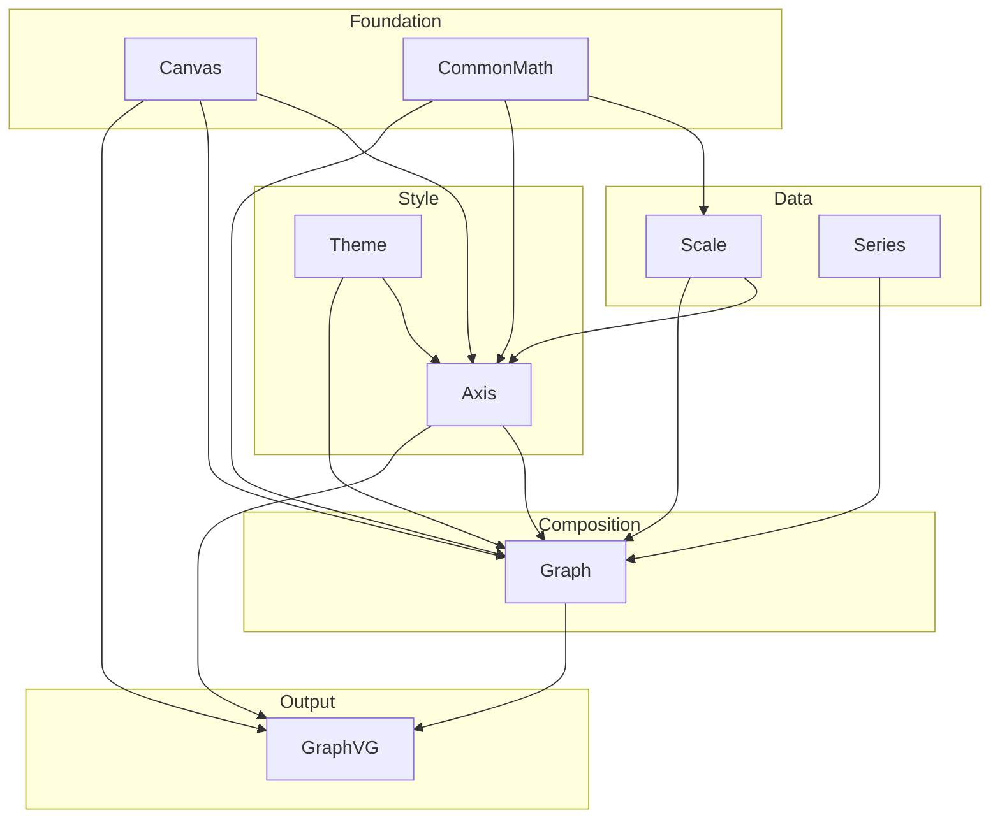

# GraphVG Design

Architecture reference for the GraphVG library. Focuses on the *why* behind structural decisions — for the *what*, read the source.

---

## Module architecture



Each layer only depends on layers below it. `CommonMath` and `Canvas` are the shared foundation with no upward dependencies.

---

## Coordinate system

Data coordinates live in a conventional mathematical space (Y up). SVG coordinates have Y pointing down. The transform pipeline applies a linear scale to each axis and inverts Y:

```
  Data space              SVG pixel space

  y                       x →
  ▲  · (xMax, yMax)       0 ──────────── 1000
  │                       │
  │  · (x, y)        →    │  · (px, py)
  │                       │
  │  · (xMin, yMin)       1000
  └──────────────── x →   y ↓
```

The X and Y scales map independently:

```
  data x:  xMin ──────────────── xMax
                  Scale.apply (linear)
  SVG px:     0 ──────────────── 1000

  data y:  yMin ──────────────── yMax
                  Scale.apply (inverted)
  SVG py:  1000 ──────────────────── 0
```

Y inversion is built into the Y scale at construction time — the pixel range is `(canvasSize, 0.0)` rather than `(0.0, canvasSize)`. No special-casing is needed at the point of use.

---

## Canvas and ViewBox

The inner canvas is always `1000×1000` in SVG user units. `GraphVG.fs` computes a padding margin for each side based on axis labels, ticks, and title, then expands the `viewBox` outward to fit:

```
  ┌──────────────────────────────────────────┐
  │               padding.Top                │
  │        ┌──────────────────────┐          │
  │        │                      │          │
  │ pad.   │  canvas              │  pad.    │
  │ Left   │  (0, 0) → (1000,1000)│  Right   │
  │        │                      │          │
  │        └──────────────────────┘          │
  │              padding.Bottom              │
  └──────────────────────────────────────────┘
    ViewBox origin = (-padding.Left, -padding.Top)
```

`GraphPadding` is a private four-sided record (`Top`, `Right`, `Bottom`, `Left`). It is intentionally separate from SharpVG's `Area` type, which only models width and height — independent sides are needed because each edge reserves a different amount of space. SharpVG primitives (`Point`, `Area`, `ViewBox`, `Rect`) are only constructed at the final step where geometry is emitted.

---

## CommonMath — unit-shape pattern

Shapes are defined as **unit offsets**: vertices relative to a center at the origin with a radius of 1. `centerPolygon` / `centerLines` place any unit shape at a real center and scale by multiplying each offset by `r` and translating by `(cx, cy)`:

```
  Unit diamond (r = 1)           At center (cx, cy), radius r

         (0, -1)                       (cx, cy-r)
            ·                              ·
           / \                            / \
  (-1, 0) ·   · (1, 0)    →   (cx-r, cy) ·   · (cx+r, cy)
           \ /                            \ /
            ·                              ·
         (0, +1)                       (cx, cy+r)
```

The same transform works for any shape. Adding a new scatter point shape is a new list of unit offsets — no new arithmetic function needed.

---

## Deferred: REQ-10 Adaptive canvas resolution

The canvas is currently fixed at `1000×1000`. When domain magnitudes are very large or very small, fixed annotation constants (tick length, font size, margin) become proportionally wrong.

The intended fix is to express annotation constants as fractions of canvas size and scale the canvas resolution to match data magnitude. This is blocked on first expressing all annotation sizes as canvas-relative fractions throughout `Axis.fs` and `GraphVG.fs`.
